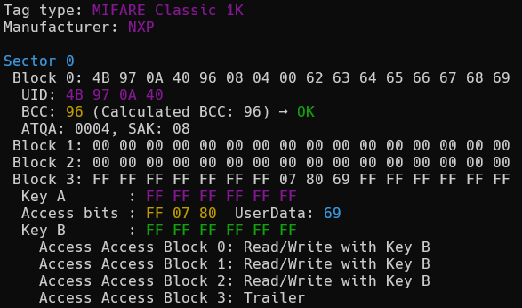
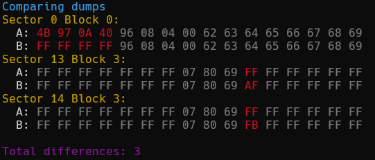
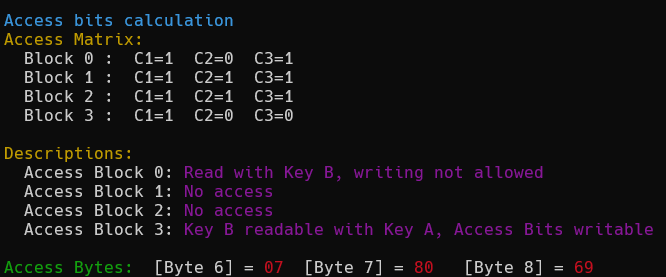

# Miflare Dump Analyse Tool (mdat.py)

 
 

🛠 A powerful command-line utility for analyzing and manipulating MIFARE Classic 1K/4K card dumps.

## ✨ Features

- 🗂 Load and display `.bin` dumps from MIFARE Classic 1K (16 sectors) and 4K (64 sectors) cards
- 🧬 Visual representation of key data structures
- 🔍 Highlight UID, BCC, ATQA, and SAK values
- 🧠 Decode and generate access bits
- 🧮 BCC calculation from custom UIDs
- 🔄 Compare two dumps, with diff-only mode
- 🌍 Multilingual: English (default) and Russian (`--lang ru`)

## 🔧 Installation

Clone the repository and run:

```bash
git clone https://github.com/te4gh0st/Miflare-Dump-Analyse-Tool.git
cd Miflare-Dump-Analyse-Tool
```
## Then run the tool with:
```bash
mdat.py --help
````
```txt
usage: mdat.py [-h] [--bits] [--lang {en,ru}] [--calc-bcc BYTE [BYTE ...]] [--calc-access HEX HEX HEX] [--gen-access] [--compare DUMP1 DUMP2] [--diff-only] [dump]

Miflare Dump Analyse Tool
Copyright (c) 2025 te4gh0st

positional arguments:
  dump                  .bin dump file

options:
  -h, --help            show this help message and exit
  --bits, -b            Show bits view (Показать биты)
  --lang {en,ru}        Language / Язык
  --calc-bcc BYTE [BYTE ...]
                        Calculate BCC for UID bytes (Вычислить BCC для байт UID)
  --calc-access HEX HEX HEX
                        Decode access bytes FF 07 08 (Декодировать байты доступа FF 07 08)
  --gen-access          Generate access bytes interactively (Интерактивная генерация бит доступа)
  --compare DUMP1 DUMP2
                        Compare two dumps (Сравнить два дампа)
  --diff-only           Show only differences when comparing (Только различия)
```
Here's the updated `README` with examples added and descriptions in English:

---

# Miflare Dump Analyse Tool (mdat.py)


🛠 A powerful command-line utility for analyzing and manipulating MIFARE Classic 1K/4K card dumps.

## ✨ Features

* 🗂 Load and display `.bin` dumps from MIFARE Classic 1K (16 sectors) and 4K (64 sectors) cards
* 🧬 Visual representation of key data structures
* 🔍 Highlight UID, BCC, ATQA, and SAK values
* 🧠 Decode and generate access bits
* 🧮 BCC calculation from custom UIDs
* 🔄 Compare two dumps, with diff-only mode
* 🌍 Multilingual: English (default) and Russian (`--lang ru`)

## 🔧 Installation

Clone the repository and run:

```bash
git clone https://github.com/te4gh0st/Miflare-Dump-Analyse-Tool.git
cd Miflare-Dump-Analyse-Tool
```

## Then run the tool with:

```bash
python mdat.py --help
```

```txt
usage: mdat.py [-h] [--bits] [--lang {en,ru}] [--calc-bcc BYTE [BYTE ...]] [--calc-access HEX HEX HEX] [--gen-access] [--compare DUMP1 DUMP2] [--diff-only] [dump]

Miflare Dump Analyse Tool
Copyright (c) 2025 te4gh0st

positional arguments:
  dump                  .bin dump file

options:
  -h, --help            show this help message and exit
  --bits, -b            Show bits view (Показать биты)
  --lang {en,ru}        Language / Язык
  --calc-bcc BYTE [BYTE ...]
                        Calculate BCC for UID bytes (Вычислить BCC для байт UID)
  --calc-access HEX HEX HEX
                        Decode access bytes FF 07 08 (Декодировать байты доступа FF 07 08)
  --gen-access          Generate access bytes interactively (Интерактивная генерация бит доступа)
  --compare DUMP1 DUMP2
                        Compare two dumps (Сравнить два дампа)
  --diff-only           Show only differences when comparing (Только различия)
```

---

## 📋 Examples of Usage

### 1. Load and Analyze a MIFARE Classic 1K Dump

To load and analyze a MIFARE Classic 1K dump, run the following command:

```bash
python3 mdat.py example/1.bin
```

**Example Output:**



### 2. Calculate the BCC for a Custom UID

To calculate the BCC for a given UID, use the following command:

```bash
python3 mdat.py --calc-bcc 00 AA BB
```

**Example Output:**

```
UID: 00 AA BB → BCC: 11
```

### 3. Compare Two Dumps and Show Only the Differences

To compare two dumps and display only the differences, run the following:

```bash
python3 mdat.py --compare example/1.bin example/2.bin --diff-only
```

**Example Output:**




### 4. Decode Access Bits for a Given Value

To decode the access bits, use the following command:

```bash
python3 mdat.py --calc-access 07 80 69
```

**Example Output:**




---

MIT License

Copyright (c) 2025 (te4gh0st) Vitaly Timtsurak
